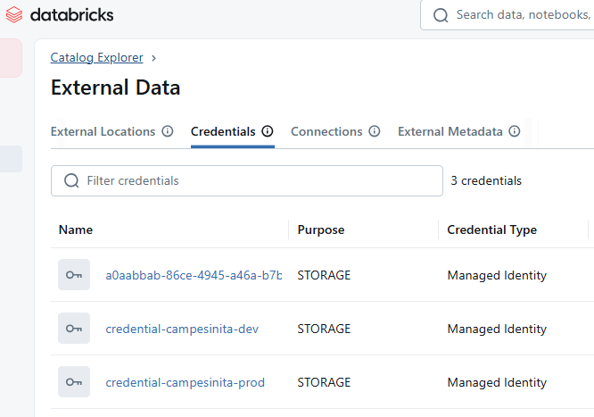
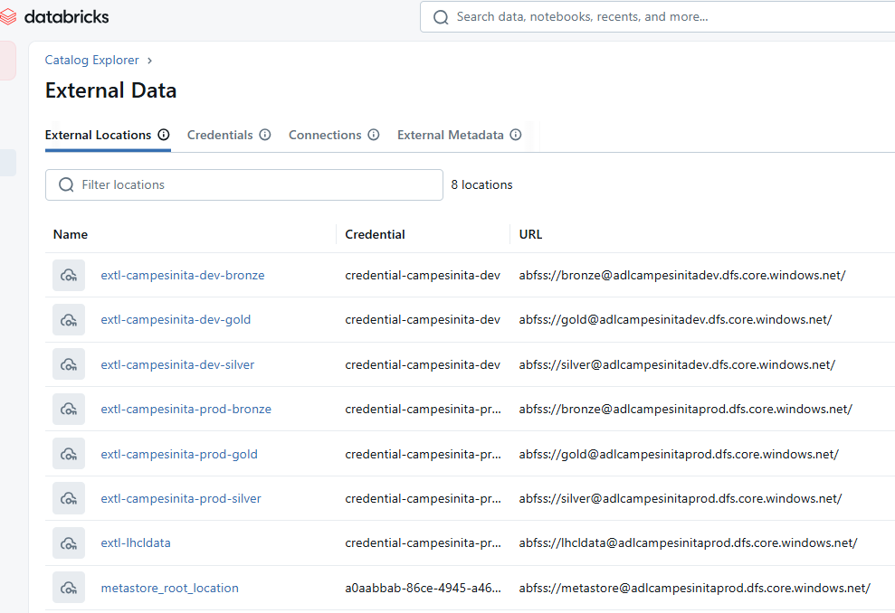

# La Campesinita - Proyecto de Ingenieria de Datos

Sistema de ingenieria de datos para retail que implementa arquitectura Medallion en Azure Databricks, procesando datos desde fuentes transaccionales hasta un modelo dimensional optimizado para analisis de negocio.

---

## Descripcion General

Este proyecto implementa un pipeline completo de datos que procesa informacion transaccional desde bases de datos operacionales hasta un modelo dimensional optimizado para analisis de negocio.

### Fuentes de Datos

**PostgreSQL (Sistema Transaccional):**
- Ventas y detalles de venta
- Inventario actual
- Clientes, productos, sucursales
- Empleados

**MySQL (Sistema ERP):**
- Proveedores
- Ordenes de compra y recepciones
- Movimientos de inventario

### Infraestructura Azure

- Azure Storage: Data Lake con capas Bronze, Silver y Gold
- Azure Databricks: Motor de procesamiento distribuido con Spark
- Unity Catalog: Gestion centralizada de metadatos y permisos
- Azure Data Factory: Orquestacion de ingestion y procesamiento

---

## Arquitectura de Datos

### Arquitectura Medallion

El proyecto implementa el patron Medallion con tres capas de refinamiento progresivo:

```
Bases de Datos Operacionales (PostgreSQL + MySQL)
    |
    | Azure Data Factory (1 PM y 9 PM Colombia)
    v
[BRONZE LAYER]
Datos crudos sin transformar
Formato: Parquet particionado por fecha
Sincronizacion: 2 veces al dia via Azure Data Factory
    |
    | Databricks Jobs (automatico al completar ingestion)
    v
[SILVER LAYER]
Datos limpios y validados
- Deduplicacion y normalizacion
- Validaciones de calidad
- Enriquecimiento con metricas calculadas
- Procesamiento: 3 tasks en paralelo
    |
    | Databricks Jobs (secuencial)
    v
[GOLD LAYER]
Modelo dimensional para analisis
- 4 Dimensiones: tiempo, clientes, productos, sucursales
- 7 Tablas de hechos: ventas, inventario, KPIs
- Optimizado con particionado y Z-ORDER
- Procesamiento: 3 tasks secuenciales
    |
    v
Apache Superset (Dashboards BI)
```

### Flujo de Procesamiento

1. **Ingestion a Bronze**: Azure Data Factory ejecuta notebooks de Databricks (1 PM y 9 PM)
2. **Trigger de Jobs**: Data Factory dispara Jobs de Databricks al completar ingestion
3. **Transformacion a Silver**: 3 tasks en paralelo (ventas, clientes, inventario)
4. **Agregacion a Gold**: 3 tasks secuenciales (dimensiones, metricas ventas, metricas inventario)
5. **Consumo**: Dashboards en Apache Superset conectados a Gold Layer

---

## Estructura del Proyecto

```
project/
├── proceso/                    # Notebooks de procesamiento ETL
│   ├── ingestion_to_bronze/    # Sincronizacion BD → Bronze
│   ├── bronze_to_silver/       # Limpieza y validacion
│   ├── silver_to_gold/         # Modelo dimensional
│   ├── Include/                # Utilidades compartidas
│   ├── validate/               # Scripts de validacion
│   └── descripcionETL.md       # Documentacion detallada del proceso ETL
│
├── scripts/                    # Notebooks de configuracion
│   ├── 1_drop_medallion.py     # Elimina catalogos y schemas
│   ├── 2_ddl_medallion.py      # Crea catalogos y schemas
│   └── 3_populate_data.py      # Ejecuta pipeline completo
│
├── dashboards/                 # Dashboards de Superset
│   ├── dashboard_ventas_ejecutivo.json
│   ├── dashboard_inventario_operacional.json
│   └── README.md               # Documentacion de dashboards
│
├── images/                     # Imagenes de configuracion Azure y Databricks
│   ├── servicios azure1.png
│   ├── servicios azure2.png
│   ├── config azure dev.png
│   ├── config azure prod.png
│   ├── containers adls dev.png
│   ├── containers adls prod.png
│   ├── credentials-databricks.png
│   └── extl-databricks.png
│
├── seguridad/                  # Configuracion de permisos
│   ├── 4_grants_medallion.py   # Permisos Unity Catalog
│   └── 5_delta_sharing.py      # Comparticion de datos
│
├── reversion/                  # Reversion de configuraciones
│   └── revocar_permisos.py     # Revoca permisos Unity Catalog
│
└── README.md                   # Este archivo
```

---

## Modelo de Datos

### Capa Gold - Modelo Dimensional

**Dimensiones:**
- **dim_tiempo**: Calendario 2024-2025 con atributos temporales (generada en Databricks)
- **dim_clientes**: Clientes segmentados con clasificacion RFM (transformada desde Silver)
- **dim_productos**: Catalogo con margenes y categorias (transformada desde Silver)
- **dim_sucursales**: 30 sucursales en Colombia (leida desde Bronze)

**Hechos de Ventas:**
- **fact_ventas**: Transacciones detalladas con metricas de margen
- **fact_kpis_diarios**: KPIs agregados por dia y sucursal
- **fact_analisis_clientes**: Segmentacion RFM con metricas de comportamiento
- **fact_rendimiento_productos**: Performance de productos por sucursal

**Hechos de Inventario:**
- **fact_inventario**: Stock actual con alertas de caducidad
- **fact_kpis_inventario**: Metricas agregadas por sucursal
- **fact_alertas_inventario**: Items que requieren accion inmediata

---

## Dashboards de Business Intelligence

El proyecto incluye 2 dashboards predefinidos para Apache Superset que visualizan los datos de Gold Layer:

### 1. Dashboard Ejecutivo de Ventas
- Ventas totales y tendencias mensuales
- Top sucursales y productos
- Margen bruto y ticket promedio
- Segmentacion RFM de clientes
- Patron de ventas por hora y dia

### 2. Dashboard Operacional de Inventario
- Valor total de inventario
- Alertas criticas y items a reabastecer
- Stock y valor por sucursal
- Productos criticos con acciones recomendadas
- Timeline de alertas

Ver [dashboards/README.md](dashboards/README.md) para instrucciones de importacion y uso

---

## Proceso ETL

El proceso de transformacion se ejecuta automaticamente via Databricks Jobs disparados por Azure Data Factory. Para documentacion tecnica detallada, consultar [descripcionETL.md](proceso/descripcionETL.md).

### Fase 1: Ingestion a Bronze (Data Factory)
- Sincronizacion desde PostgreSQL (7 tablas) y MySQL (5 tablas)
- Ejecutado por Azure Data Factory a las 1 PM y 9 PM (hora Colombia)
- Formato Parquet con compresion Snappy
- Particionado por fecha de sincronizacion
- Metadatos de auditoria incluidos

### Fase 2: Bronze a Silver (Databricks Jobs)
- Ejecucion paralela de 3 tasks en Databricks Job
- Limpieza y validacion de tipos de datos
- Deduplicacion con reglas de preferencia
- Enriquecimiento con metricas calculadas

### Fase 3: Silver a Gold (Databricks Jobs)
- Ejecucion secuencial de 3 tasks en Databricks Job
- Construccion de dimensiones y tablas de hechos
- Aplicacion de optimizaciones (OPTIMIZE, Z-ORDER)

**Tiempo total del pipeline:** 25-35 minutos

**Frecuencia de ejecucion:** 2 veces al dia (1 PM y 9 PM hora Colombia)

---

## Configuracion y Despliegue

### Prerequisitos Azure

Infraestructura Azure ya configurada:

- Databricks Workspace: adb-campesinita-dev
- Unity Catalog con 2 catalogos: adbslacampesinitadev y adbslacampesinitaprod
- Storage Accounts: adlcampesinitadev y adlcampesinitaprod
- Contenedores en cada Storage Account: bronze, silver, gold
- Access Connectors: acdb-campesinita-dev y acdb-campesinita-prod (Managed Identity)
- Credentials: credential-campesinita-dev y credential-campesinita-prod
- External Locations: 6 locations (3 por ambiente)
- Data Factory: adf-campesinita
- Key Vault: keys-campesinita (scope: accesskeys-campesinita)

### Infraestructura Azure Configurada

**Servicios Azure desplegados:**


**Configuracion de Storage Account y Access Connector:**

Ambiente Dev:


Ambiente Prod:


**Contenedores en Azure Data Lake Storage:**

Ambiente Dev:


Ambiente Prod:


**Configuracion de Databricks:**

Credentials configuradas:


External Locations configuradas:


### Despliegue del Proyecto

El despliegue se realiza automaticamente via GitHub Actions. No se despliega desde tu maquina local.

**Configurar Secrets en GitHub:**

1. GitHub → Settings → Secrets and variables → Actions
2. Crear secrets:
   - `DATABRICKS_HOST`: URL del workspace (ej: https://adb-xxxxx.azuredatabricks.net)
   - `DATABRICKS_TOKEN_DEV`: Token de acceso para catalogo dev
   - `DATABRICKS_TOKEN_PROD`: Token de acceso para catalogo prod

**Deploy Automatico a Dev:**

1. Hacer cambios en notebooks (proceso, scripts, seguridad)
2. Commit y push a main:
```bash
cd project_campesinita
git add .
git commit -m "Actualizar notebooks"
git push origin main
```
3. GitHub Actions sube notebooks a `/Workspace/la_campesinita/` y ejecuta setup automaticamente

**Deploy Automatico a Prod:**

1. Crear release en GitHub:
```bash
cd project_campesinita
git tag -a v1.0.0 -m "Release v1.0.0"
git push origin v1.0.0
```
2. GitHub → Releases → Create release
3. GitHub Actions sube notebooks a `/Workspace/la_campesinita/`
4. Ejecutar setup manualmente desde Databricks con widget ambiente: prod

**Unity Catalog configurado:**
- Metastore creado y asociado al workspace adb-campesinita-dev
- 2 Catalogos: adbslacampesinitadev (dev), adbslacampesinitaprod (prod)
- Schemas por catalogo: bronze, silver, gold

**Storage Credentials configuradas:**
- credential-campesinita-dev: Usa acdb-campesinita-dev (Managed Identity)
- credential-campesinita-prod: Usa acdb-campesinita-prod (Managed Identity)

**External Locations configuradas:**

Ambiente Dev:
- extl-campesinita-dev-bronze: abfss://bronze@adlcampesinitadev.dfs.core.windows.net/
- extl-campesinita-dev-silver: abfss://silver@adlcampesinitadev.dfs.core.windows.net/
- extl-campesinita-dev-gold: abfss://gold@adlcampesinitadev.dfs.core.windows.net/

Ambiente Prod:
- extl-campesinita-prod-bronze: abfss://bronze@adlcampesinitaprod.dfs.core.windows.net/
- extl-campesinita-prod-silver: abfss://silver@adlcampesinitaprod.dfs.core.windows.net/
- extl-campesinita-prod-gold: abfss://gold@adlcampesinitaprod.dfs.core.windows.net/

### Configuracion de Data Factory

**Paso 1: Crear Databricks Job**

1. Databricks → Workflows → Create Job
2. Name: `Processing_Bronze_to_Gold`
3. Agregar 6 Tasks con rutas en Workspace:

Task 1: Bronze_to_Silver_Ventas
- Path: `/Workspace/la_campesinita/proceso/bronze_to_silver/ventas_consolidadas`
- Depends on: ninguno

Task 2: Bronze_to_Silver_Clientes
- Path: `/Workspace/la_campesinita/proceso/bronze_to_silver/clientes_segmentados`
- Depends on: ninguno

Task 3: Bronze_to_Silver_Inventario
- Path: `/Workspace/la_campesinita/proceso/bronze_to_silver/inventario_productos`
- Depends on: ninguno

Task 4: Silver_to_Gold_Dimensiones
- Path: `/Workspace/la_campesinita/proceso/silver_to_gold/modelo_dimensional`
- Depends on: Task 1, Task 2, Task 3

Task 5: Silver_to_Gold_Metricas_Ventas
- Path: `/Workspace/la_campesinita/proceso/silver_to_gold/metricas_ventas`
- Depends on: Task 4

Task 6: Silver_to_Gold_Metricas_Inventario
- Path: `/Workspace/la_campesinita/proceso/silver_to_gold/metricas_inventario`
- Depends on: Task 4

4. Copiar Job ID de la URL

**Paso 2: Crear Pipeline en Data Factory**

1. Azure Portal → adf-campesinita → Author → New Pipeline
2. Name: `Pipeline_Ingestion_and_Processing_Dev`
3. Agregar 3 Activities:

Activity 1: Sync_PostgreSQL (Databricks Notebook)
- Path: `/Workspace/la_campesinita/proceso/ingestion_to_bronze/sync_postgres_to_bronze`

Activity 2: Sync_MySQL (Databricks Notebook)
- Path: `/Workspace/la_campesinita/proceso/ingestion_to_bronze/sync_mysql_to_bronze`
- Depends on: Activity 1 (Success)

Activity 3: Trigger_Processing_Job (Databricks Job)
- Job ID: [pegar Job ID copiado]
- Depends on: Activity 2 (Success)

4. Publish

**Paso 3: Crear Trigger**

1. Pipeline → Add trigger → New
2. Name: `Trigger_Ingestion_1PM_9PM`
3. Type: Schedule
4. Recurrence: Daily at 13:00, 21:00
5. Time zone: (UTC-05:00) Bogota
6. Publish

### Setup Inicial (Primera Vez)

**Opcion 1: Automatico via GitHub Actions (Recomendado)**

Push a main ejecuta automaticamente:
1. Sube notebooks a `/Workspace/la_campesinita/`
2. Ejecuta scripts de setup con ambiente: dev
3. Configura permisos

**Opcion 2: Manual desde Databricks**

Ejecutar notebooks en orden desde `/Workspace/la_campesinita/`:
1. `scripts/1_drop_medallion.py` - Widget ambiente: dev
2. `scripts/2_ddl_medallion.py` - Widget ambiente: dev
3. `scripts/3_populate_data.py` - Ejecuta pipeline completo
4. `seguridad/4_grants_medallion.py` - Widget ambiente: dev

### Operacion Continua (Automatica)

Una vez completado el setup inicial, el sistema opera automaticamente:

**1. Azure Data Factory sincroniza datos a Bronze:**
- Horario: 1:00 PM y 9:00 PM (hora Colombia)
- Ejecuta notebooks de ingestion desde Repos
- Al completar exitosamente, dispara Jobs de Databricks

**2. Databricks Jobs procesan datos entre capas:**
- Job: `Processing_Bronze_to_Gold`
- Tasks ejecutadas en paralelo y secuencial segun dependencias:
  - Bronze → Silver (3 notebooks en paralelo)
  - Silver → Gold (3 notebooks secuenciales)
- Tiempo estimado: 25-35 minutos

**3. Datos disponibles en Gold Layer:**
- Listos para consumo en Apache Superset
- Actualizados 2 veces al dia

---

## Volumetria y Performance

### Datos Procesados
- Bronze Layer: 1.85 GB (7.6M registros de 12 tablas)
- Silver Layer: 1.2 GB (datos limpios y validados)
- Gold Layer: 800 MB (modelo dimensional optimizado)

### Metricas de Ejecucion
- Ingestion a Bronze: Variable segun volumetria de BD
- Bronze to Silver: 10-15 minutos (paralelo)
- Silver to Gold: 15-20 minutos (secuencial)
- Pipeline completo: 25-35 minutos

### Recursos Recomendados
- Cluster: Standard_DS3_v2 o superior
- Workers: 2-4 workers
- Spark: 3.4 o superior
- DBR: 13.3 LTS o superior

---

## Seguridad y Gobierno

### Control de Acceso

El proyecto implementa control de acceso basado en roles mediante Unity Catalog:

**Grupo Analitica:**
- READ en catalogo Bronze (ambos ambientes)
- WRITE en catalogos Silver y Gold (ambos ambientes)
- Miembros: Analista Andres

**Service Principal CI/CD:**
- ALL PRIVILEGES en catalogos dev y prod
- Usado para despliegues automaticos

### Auditoria

Todas las transformaciones incluyen metadatos de auditoria:
- Timestamp de transformacion
- Usuario que ejecuto el proceso
- Version del notebook ejecutado

---

## Documentacion Adicional

- **Proceso ETL Detallado**: [proceso/descripcionETL.md](proceso/descripcionETL.md)
- **Scripts de Configuracion**: [scripts/](scripts/) - Setup automatizado
- **Configuracion de Permisos**: [seguridad/](seguridad/) - Permisos Unity Catalog
- **Dashboards**: [dashboards/](dashboards/) - Archivos JSON para importar en Superset

---

## Notas Importantes

### Origen de Dimensiones
- **dim_tiempo**: Generada desde codigo en Databricks
- **dim_clientes y dim_productos**: Transformadas desde Silver con logica de negocio
- **dim_sucursales**: Leida desde Bronze (datos maestros sincronizados desde PostgreSQL)

### Prerequisitos de Ejecucion
- Repositorio vinculado en Databricks Repos
- Bronze Layer debe contener datos antes de ejecutar pipeline
- Sincronizacion a Bronze via Azure Data Factory
- Verificar conectividad a Azure Storage

### Optimizaciones Aplicadas
- Particionado inteligente por dimensiones clave
- Z-ORDER en columnas de consulta frecuente
- OPTIMIZE despues de cada escritura
- Delta Lake para versionamiento y transacciones ACID

---

Proyecto educativo - Ingenieria de Datos
